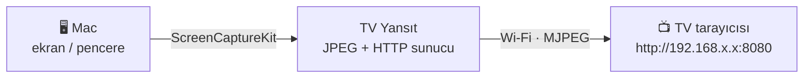

<p align="center">
  
</p>

<h1 align="center">TV Yansıt</h1>

<p align="center">
  <b>Mac ekranını AirPlay desteklemeyen eski Smart TV'lere kablosuz yansıt.</b><br>
  Ek cihaz yok, TV'ye uygulama kurmak yok. Sadece TV'nin web tarayıcısı.
</p>

<p align="center">
  <a href="https://github.com/mstkyvz/tv-yansit/releases/latest"></a>
  
  
  <a href="LICENSE"></a>
</p>

---

## Neden?

Mac'ler ekranı yalnızca **AirPlay** ile yansıtır. 2018 öncesi LG, Samsung, Sony vb. TV'lerin çoğu ise yalnızca **Miracast** destekler. Bu yüzden Windows ve Android telefonlar TV'yi bulur ama Mac bulamaz.

TV Yansıt bu sorunu TV'nin **web tarayıcısı** üzerinden çözer. Mac'te küçük bir sunucu çalıştırır ve seçtiğin ekranı ya da pencereyi, en eski tarayıcıların bile gösterebildiği **MJPEG** akışı olarak yayınlar. Deskreen gibi WebRTC kullanan araçlar eski TV tarayıcılarında beyaz ekran verirken bu yöntem orada da çalışır.



## Özellikler

- 🖥️ **Ekran veya tek pencere seçimi:** Tüm ekranı ya da yalnızca bir uygulamanın penceresini (ör. UTM sanal makinesi, sunum, video oynatıcı) yayınla.
- 🔁 **Canlı kaynak değiştirme:** Yayın sürerken başka bir pencere seç, TV'de sayfayı yenilemeden görüntü değişir.
- 📺 **Eski tarayıcı uyumlu:** Sayfa yalnızca ES5 JavaScript kullanır. MJPEG desteklemeyen tarayıcılar için `/yedek` modu da var.
- 👥 **Birden çok izleyici:** Aynı anda TV, telefon ve tablet bağlanabilir. Kare bir kez kodlanır, herkese gönderilir.
- ⚙️ **Ayarlanabilir:** Akıcılık (5–30 fps), çözünürlük (640–1920) ve JPEG kalitesi yayın sırasında değiştirilebilir.
- 🪶 **Bağımlılık yok:** Yerel Swift ve SwiftUI ile yazıldı, yaklaşık 1 MB. ffmpeg, Python ya da Electron gerekmez.

## Kurulum

### Homebrew (önerilen)

```bash
brew install --cask mstkyvz/tap/tv-yansit
```

### Elle

1. [Releases](https://github.com/mstkyvz/tv-yansit/releases/latest) sayfasından `TVYansit-x.y.z.zip` dosyasını indir.
2. Açıp **TV Yansıt.app** uygulamasını **Uygulamalar** klasörüne sürükle.
3. Uygulama Apple tarafından onaylanmadığı (notarize edilmediği) için ilk açılışta macOS uyarı verir. Terminal'de şunu bir kez çalıştır:
   ```bash
   xattr -dr com.apple.quarantine "/Applications/TV Yansıt.app"
   ```
   Ya da **Sistem Ayarları → Gizlilik ve Güvenlik** sayfasının altındaki **"Yine de Aç"** butonunu kullan.

### Kaynaktan derleme

Xcode gerekmez, Command Line Tools yeterli (`xcode-select --install`).

```bash
git clone https://github.com/mstkyvz/tv-yansit.git
cd tv-yansit
./scripts/build.sh
open "build/TV Yansıt.app"
```

## Kullanım

1. **TV Yansıt**'ı aç. İlk açılışta **Ekran Kaydı** izni ister: **Sistem Ayarları → Gizlilik ve Güvenlik → Ekran ve Sistem Sesi Kaydı** bölümünde aç, sonra uygulamayı yeniden başlat.
2. **Ekranlar** ya da **Pencereler** sekmesinden yayınlamak istediğin kaynağı seç.
3. **Yayını Başlat**'a bas.
4. TV'de **Web Tarayıcı** uygulamasını aç ve uygulamanın üstünde yazan adresi gir, ör. `http://192.168.1.5:8080`.

> [!TIP]
> Görüntü takılıyorsa önce **çözünürlüğü** 960'a, sonra **akıcılığı** 10 fps'e düşür. Metin okunmuyorsa kaliteyi artır.

## Sık sorulan sorular

<details>
<summary><b>TV'de sayfa hiç açılmıyor</b></summary>

- Mac ve TV **aynı Wi‑Fi ağında** mı? Misafir ağları cihazların birbirini görmesini engeller.
- Mac'te VPN (Tailscale, Outline vb.) açıksa kapat.
- **Sistem Ayarları → Ağ → Güvenlik Duvarı** açıksa TV Yansıt'a gelen bağlantılara izin ver.
- Uygulamada birden çok adres görünüyorsa "Diğer adresler" satırındakileri de dene.
</details>

<details>
<summary><b>Sayfa açılıyor ama görüntü gelmiyor</b></summary>

Sayfanın altındaki **yedek moda** bağlantısına tıkla ya da adresin sonuna `/yedek` ekle (`http://192.168.1.5:8080/yedek`). Bu mod MJPEG yerine resimleri tek tek yeniler.
</details>

<details>
<summary><b>Ses gidiyor mu?</b></summary>

Hayır, şimdilik yalnızca görüntü gider. Sesi Mac'ten, Bluetooth hoparlörden ya da TV'ye bağlı bir ses sisteminden dinleyebilirsin.
</details>

<details>
<summary><b>Gecikme ne kadar?</b></summary>

Yerel ağda genellikle 0,2–0,5 saniye. Sunum, belge, tarayıcı ve uzak masaüstü için uygun. Hızlı oyunlar için uygun değil.
</details>

<details>
<summary><b>Hangi TV'lerde çalışır?</b></summary>

Web tarayıcısı olan hemen her Smart TV'de çalışır: LG webOS (2014+), Samsung Tizen, Android TV, Fire TV (Silk), Sony vb. 2017 model LG UJ serisi (webOS 3.5) üzerinde geliştirildi. Tarayıcısı olan telefon, tablet ve bilgisayarlar da izleyici olarak bağlanabilir.
</details>

## Nasıl çalışır?

| Bileşen | Görevi |
|---|---|
| `CaptureEngine` | ScreenCaptureKit ile seçilen ekranı veya pencereyi yakalar, her kareyi Core Image ile JPEG'e çevirir |
| `FrameStore` | Son kareyi tutar ve bekleyen istemcilere dağıtır. Yavaş istemciler kare atlar, gecikme birikmez |
| `HTTPServer` | Network.framework ile `/`, `/akis` (multipart MJPEG), `/yedek` ve `/kare.jpg` yollarını sunar |
| `AppModel` / `ContentView` | SwiftUI arayüzü: kaynak listesi ve önizlemeler, ayarlar, yerel IP tespiti |

`python/tv_yansit.py` dosyası, ffmpeg ile çalışan ilk prototiptir. Tek dosyalık bir alternatif olarak durur.

## Katkı

Hata bildirimleri ve pull request'ler memnuniyetle karşılanır. Özellikle farklı TV markalarında denediysen hangi modelde çalıştığını bir issue ile bildirmen çok işe yarar.

## Lisans

[MIT](LICENSE)

---

<sub><b>English:</b> TV Yansıt mirrors a Mac screen or a single window to older smart TVs without AirPlay (e.g. 2017 LG webOS) through the TV's built‑in web browser, using an MJPEG stream that even very old browsers can display. Native Swift/SwiftUI with ScreenCaptureKit and no dependencies. Install with <code>brew install --cask mstkyvz/tap/tv-yansit</code>.</sub>
